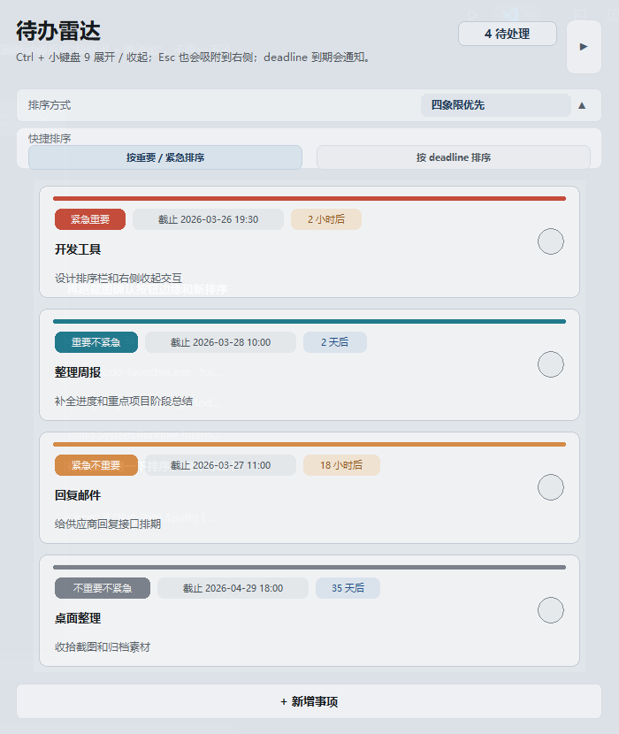
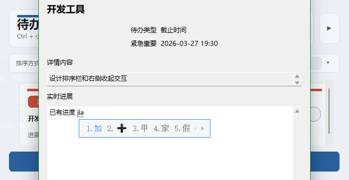
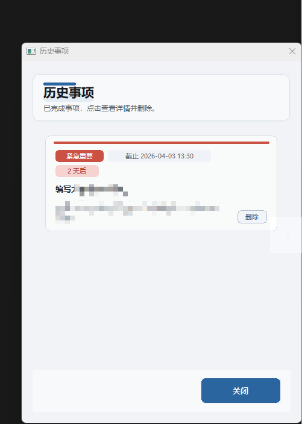

# Todo Launcher

一个用 Go + Walk 实现的原生 Windows 待办面板，主打“随叫随用、贴边收起”。

## 快速预览

主面板


贴边收起


排序与清单



详情页



历史事项



## 全局热键和设置

- 默认：`Ctrl + 小键盘 9` 用于快速呼出/收起主界面
- 设置请右键状态栏小图标

## 待办清单

- 圆角卡片展示
- 支持四象限类型（艾森豪威尔矩阵）：紧急重要 / 紧急不重要 / 重要不紧急 / 不重要不紧急
- 支持修改事件截止时间、倒数时间、到期提醒、临期变色
- 支持添加进展

## 排序方式

- 艾森豪威尔矩阵排序
- 截止时间排序

## 标签

- 新增/详情页可填写标签（逗号分隔）
- 卡片上显示第一个标签（在倒计时后）

## 标签搜索

- 底部“标签搜索”按钮
- 输入标签后仅显示匹配事项

## 详情页（右键）

- 右键待办进入详情
- 可编辑详情内容与实时进展
- 编辑自动保存

## 推迟与删除

- 待办支持推迟截止时间
- 历史事项支持删除

## 历史事项

- 托盘右键菜单打开历史面板
- 历史事项可查看详情或删除

## 设置项

- 事件到期变色时间
- 事件到期提醒
- 界面背景

## 开机启动

- 设置中勾选
- 采用 Startup 目录 `TodoLauncher.cmd`

## 数据位置

- `%APPDATA%\todo-launcher\todos.json`

## 运行

```powershell
todo-launcher.exe
```

## 构建

```powershell
go build -ldflags "-H=windowsgui" -o todo-launcher.exe .
```

# 开发功能迭代历史

- 2026-03-26：原生窗口与主面板布局完成
- 2026-03-27：详情页、排序、收起交互完善
- 2026-03-30：历史事项、标签、搜索、提醒、开机启动与动效细化
- 2026-04-02：修复UI显示问题，增加高度伸缩功能和位置记录功能，现在允许调整主面板展开的位置